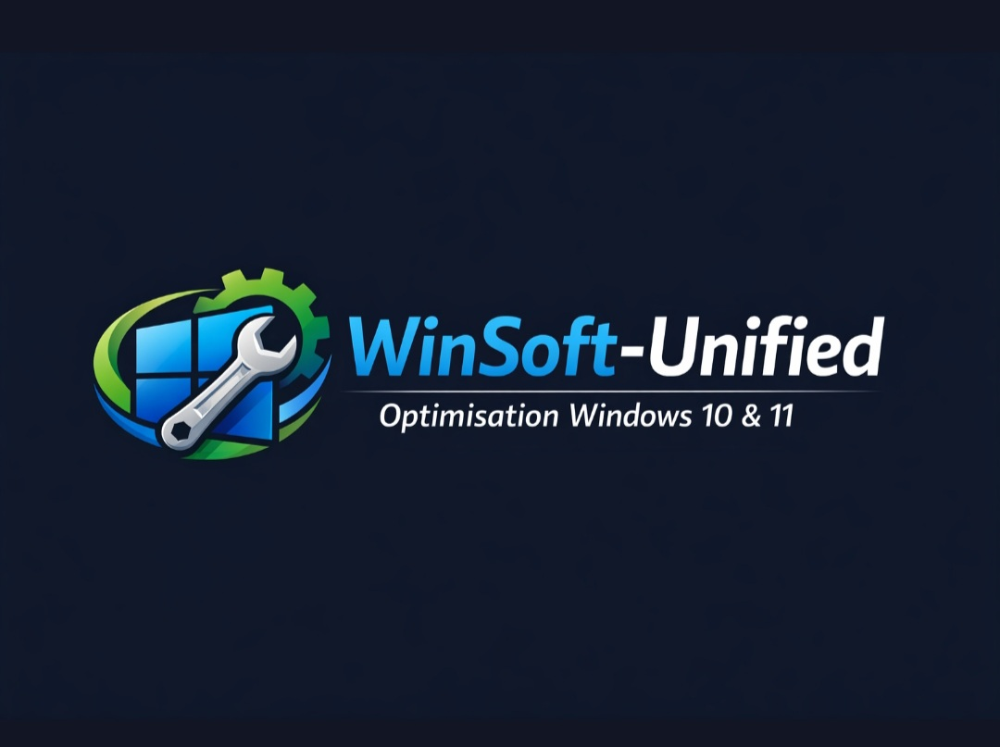

> `README.md` principal complet parfaitement aligné avec le projet `WinSoft v1.0` et avec une présentation moderne de type `framework open‑source`.

- à la racine

```
~WinSoft/ README.md
```
---
###### 🟦 README.md — `markdown`

<div align="center">
  
# 🪛 WINSOFT 1.0
  </p>
</div>

- Framework `PowerShell` modulaire pour optimiser `Windows 10 & 11`



>WinSoft est un framework PowerShell propre, modulaire et maintenable, conçu pour :  
- alléger Windows  
- supprimer les applications inutiles  
- optimiser les services  
- appliquer des réglages système  
- automatiser la maintenance  

>Compatible Windows 10, Windows 11, et pensé pour évoluer.

---

🧭 Présentation

WinSoft fournit une architecture claire et modulaire permettant :

- une détection automatique de la version de Windows  
- un système de configuration centralisé  
- des modules séparés pour Win10 et Win11  
- un logging propre avec rotation  
- des tests pour garantir la stabilité  
- une maintenance simplifiée  

>L’objectif : offrir un outil professionnel, fiable et extensible pour optimiser Windows sans risque.

---

🏗️ Architecture du projet

```text
WinSoft/
├── README.md
├── CHANGELOG.md
├── ROADMAP.md
├── CONTRIBUTING.md
├── CODEOFCONDUCT.md
├── SECURITY.md
├── SUPPORT.md
├── CODEOWNERS
├── LICENSE
│
├── config/
│   ├── README.md
│   ├── apps-common.txt
│   ├── apps-win10.txt
│   ├── apps-win11.txt
│   ├── load_config.ps1
│   ├── validate_config.ps1
│   └── update_config.ps1
│
├── scripts/
│   ├── main.ps1
│   ├── detect_os.ps1
│   ├── debloat.ps1
│   ├── optimize.ps1
│   ├── utils.ps1
│   ├── logging.ps1
│   ├── checks.ps1
│   └── menu.ps1
│
├── modules/
│   ├── Win10/
│   └── Win11/
│
├── logs/
├── assets/
└── tests/
```

---

🚀 Fonctionnalités principales

✔ Détection automatique de l’OS
- Windows 10 / Windows 11 → modules adaptés automatiquement.

✔ Debloat intelligent
- Suppression propre des applications listées dans config/.

✔ Optimisation système
- Services, tâches planifiées, réglages de performance.

✔ Configuration centralisée
- Fichiers .txt + scripts de gestion (load, validate, update).

✔ Logging professionnel
- rotation automatique  
- logs horodatés  
- dossier dédié  

✔ Architecture modulaire
- Chaque OS possède ses propres modules :

```text
modules/Win10/
modules/Win11/
```

✔ Tests intégrés
- Scripts de validation dans tests/.

---

📘 Documentation

La documentation est répartie dans plusieurs fichiers :

- config/README.md — gestion des fichiers de configuration  
- scripts/ — scripts principaux du framework  
- modules/ — modules spécifiques Win10 / Win11  
- ROADMAP.md — vision et évolutions prévues  
- CHANGELOG.md — historique des versions  

---

🛠️ Installation

1. Cloner le dépôt

`powershell
git clone https://github.com/.../WinSoft.git
cd WinSoft
`

2. Lancer le script principal

`powershell
powershell.exe -ExecutionPolicy Bypass -File .\scripts\main.ps1
`

---

📂 Configuration

Les fichiers de configuration se trouvent dans :

`
config/
`

Ils permettent de définir :

- les applications à supprimer  
- les règles spécifiques Win10 / Win11  
- les presets futurs (Gaming, Entreprise, Ultra‑Lite…)  

Les scripts utilitaires :

- load_config.ps1  
- validate_config.ps1  
- update_config.ps1  

---

🤝 Contribuer

Les contributions sont les bienvenues !

Consultez :  
👉 CONTRIBUTING.md  
👉 CODEOFCONDUCT.md  
👉 SUPPORT.md

---

🔐 Sécurité

Pour signaler une faille ou un comportement suspect :  
👉 consultez SECURITY.md

---

🗺️ Roadmap

La roadmap complète est disponible dans :  
👉 ROADMAP.md

Extraits :

- v1.1 → amélioration des modules  
- v2.0 → dashboard interactif + presets  
- v3.0 → support Windows Server  

---

📄 Licence

Projet sous licence MIT (modifiable si tu veux).

---

<div align="center">

Merci d’utiliser WinSoft 💙  
N’hésitez pas à contribuer, proposer des idées ou ouvrir des issues.

</div>
`

---
